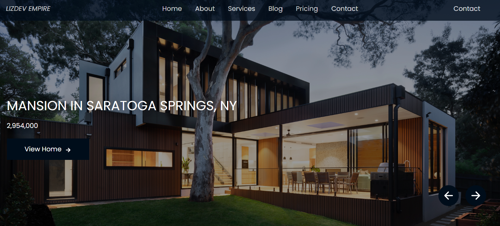
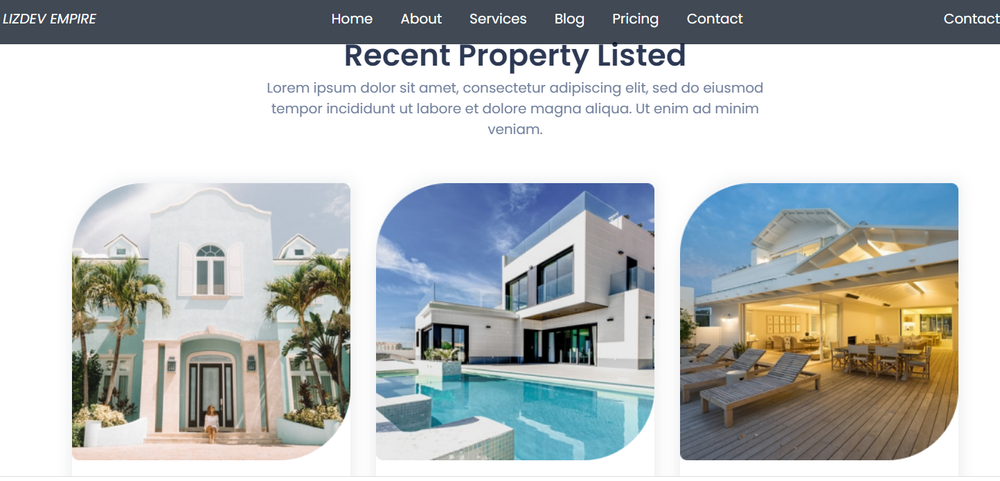
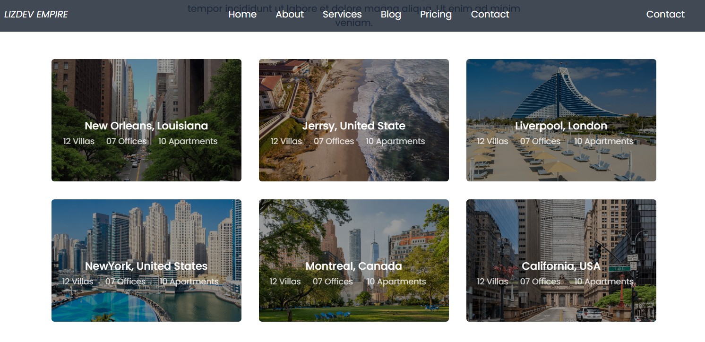

# Awesome Estate
The Awesome estate web application displays a list of apartments that were provided by a local data. The users can check out the featured and recebt apartment. Also, the user can click the house to get the details of the selected house.

 The application consist of six pages, all of which are functioning.

This is a personal project I built to practise my knowledge of React js. The objective was to mimic the appearance of a dynamic web application, in a similar way a web developer would receive the requirements as if it were in a job.

## Live Demo

## Getting started

To get a local copy up and running follow these simple example steps:

### Prerequisites

- A device that support running browser applications.
- access to internet connection.

### Setup

#### View pages from the browser

- If you just want to check the webpage/webapp, you have it available on the live demo link.

#### Install locally the code of the application

In order to install a local version of this project and please do the following steps:
- Install the latest version of any code editor.
- install the latest version of GIT.
- open your terminal
- Go to the [repository](https://github.com/Lizdev-05/awesome-estate)  and clone it with `git clone git@github.com:Behnam1369/Awesome-estate.git' .
- open the repository cloned with `cd Awesome-estate`
- if your code editor is VsCode type `code .`
- Install webpack with: `npm install --save-dev webpack webpack-cli`
- To run it type `nmp run start` or run live server from the docs directory
- To test it `npm run test`
- and enjoy!

## Technologies Used

- CSS
- JAVASCRIPT
- React Js
- Linters
- GitFlow
- GitHub
- VsCode
- nodejs

## Author

👤 **Ojesanmi Elizabeth Oyin**

- GitHub: [@githubhandle](https://github.com/Lizdev-05)

- LinkedIn: [LinkedIn](https://www.linkedin.com/in/elizabeth-oyinlade-ojesanmi-0702aa16a)

## Contributing

Contributions, issues, and feature requests are welcome!

## Show your support

Please give a ⭐️ if you like this project!

## Acknowledgments

- Hat tip to anyone contributed one way or the other.
- Inspiration
- etc

## License

This project is [MIT](https://github.com/microverseinc/readme-template/blob/master/MIT.md) licensed
